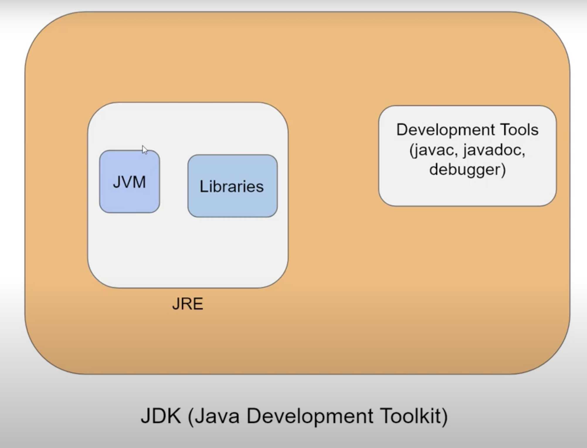
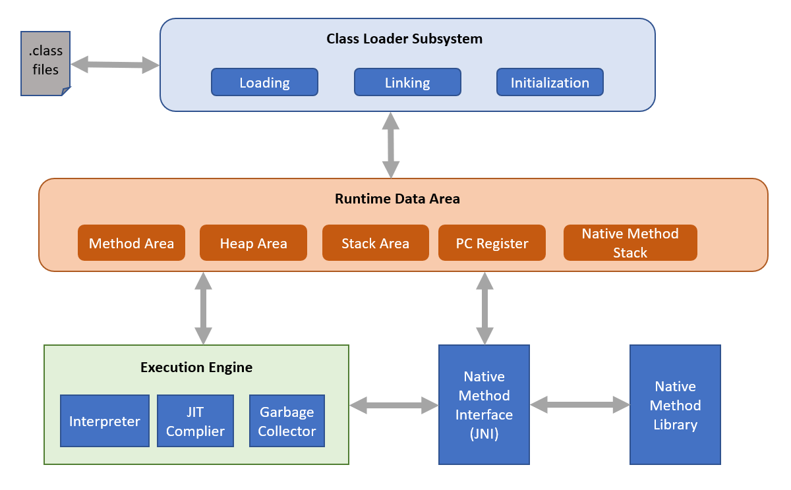

# Introduction to Java

## Definition and History of Java
Java is a high level, robust, object-oriented and secure programming language.

Java was developed by Sun Microsystems (which is now the subsidiary of Oracle) in the year 1995. James Gosling is known as the father of Java. Before Java, its name was Oak. Since Oak was already a registered company, so James Gosling and his team changed the name from Oak to Java. Java was designed for flexibility and portability, allowing it to run on various devices and platforms.

## Types of Java Application
- **Standalone Applicaiton:** Standalone applications are also known as desktop applications or window-based applications. These are traditional software that we need to install on every machine. Examples of standalone application are Media player, antivirus, etc. AWT and Swing are used in Java for creating standalone applications.

- **Web Applicaiton:** An application that runs on the server side and creates a dynamic page is called a web application. Currently, Servlet, JSP, Struts, Spring, Hibernate, JSF, etc. technologies are used for creating web applications in Java.

- **Enterprise Applicaiton:** An application that is distributed in nature, such as banking applications, etc. is called an enterprise application. It has advantages like high-level security, load balancing, and clustering. In Java, EJB is used for creating enterprise applications.

- **Mobile Applicaiton:** An application which is created for mobile devices is called a mobile application. Currently, Android and Java ME are used for creating mobile applications.

## Java Buzzwords
Java is characterized by several defining buzzwords:

- **Simple**: Intuitive and user-friendly.
- **Object-Oriented**: Java uses the OOP paradigm for organized, modular coding.
- **Platform Independent**: Code written in Java can run on any device with a JVM.
- **Secure**: Java comes fortified with inherent security features.
- **Architecture Neutral**: No architectural dependency ensures Java's portability.
- **Portable**: With JVM, bytecode is compatible with any OS or device.
- **Robust**: Equipped with robust memory management and error-handling capabilities.
- **Multithreaded**: Designed to execute several threads simultaneously.
- **High Performance**: Bytecode nearly matches the performance of native code.
- **Distributed**: Tailored for the internet's distributed environment.


## The Internet and Java's Place in IT
Java plays a significant role in web development, enterprise applications, and mobile development. With its platform-independent nature and security features, Java is widely used for developing secure web applications, cloud computing solutions, and enterprise-level systems.

## Applets

- **Applets**: Small Java programs that run within a web browser, though they have become less common due to security concerns and the evolution of web technologies.

## Java Virtual Machine (JVM)
JVM is an integral part of Java's runtime environment. It allows Java applications to run on any platform without modification by converting Java bytecode into machine code.

## Architecture of Java


## Architecture of JVM (Java Virtual Machine)



## Bytecode – Not an Executable Code
Java programs are compiled into an intermediate format called bytecode, which is then interpreted by the JVM. This allows Java to maintain its platform independence.

## Procedure-Oriented vs. Object-Oriented Programming
| Feature                      | Procedure-Oriented Programming (POP)      | Object-Oriented Programming (OOP) |
|------------------------------|--------------------------------------|-----------------------------------|
| **Basic Concept**            | Focuses on procedures (functions) and structured programming. | Focuses on objects that contain both data and behavior. |
| **Modularity**               | Programs are divided into functions. | Programs are divided into objects and classes. |
| **Data Handling**            | Data is generally stored in variables and passed between functions. | Data is encapsulated within objects and accessed through methods. |
| **Security**                 | Data is less secure since it is accessible by any function. | Data is more secure due to encapsulation and access modifiers. |
| **Code Reusability**         | Functions can be reused but may lead to code duplication. | Code reusability is improved using inheritance and polymorphism. |
| **Maintainability**          | More difficult to maintain as code grows larger. | Easier to maintain and modify due to modular structure. |
| **Abstraction**              | Limited or no abstraction. | Provides abstraction through classes and interfaces. |
| **Examples**                 | C, older Java programs using static methods.(Example: C, Fortran, BASIC, Pascal, COBOL) | Modern Java applications using classes, objects, and OOP principles. (Example: Java, C++, Python, Ruby, Swift, Kotlin) |


## Compiling and Running a Simple Program

1. **Writing a Java Program**: Creating a source code file (.java) with a class definition and a main method.

``` java
public class HelloWorld {
    public static void main(String[] args) {
        System.out.println("Hello, World!");
    }
}
```
2. **Compiling**: Using the `javac` compiler to convert the source code into bytecode.

``` java
javac HelloWorld.java
```
3. **Interpreting and Running the Program**: The bytecode is executed by the JVM using the `java` command.
``` java
java HelloWorld 
or 
java HelloWorld.java
```


## Setting up Your Computer for Java Environment
To set up Java, follow these steps:

- Install the Java Development Kit (JDK).
- Set up environment variables (`JAVA_HOME` and `PATH`).
- Verify installation using the `java -version` and `javac -version` commands.

## Path and ClassPath Variables
- **Path Variable:** This OS environment variable locates executable files. For Java, the Path variable ensures Java tools like javac and java run from any directory in the command line.

- **ClassPath Variable:** Point ClassPath to the directory or a JAR where .class files reside. The JVM uses ClassPath to locate and load classes during runtime.
